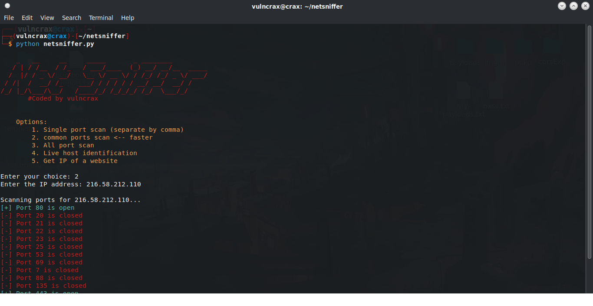
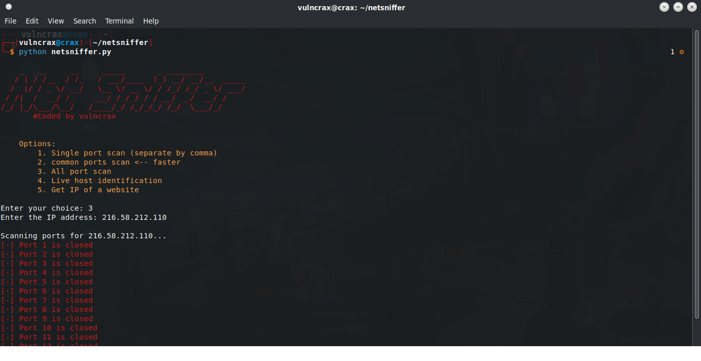
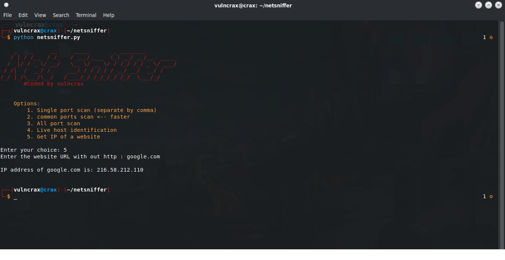

<center></center>
<h1 align="center">NetSniffer</h1>
<h3>NetSniffer: Your essential Linux tool for network reconnaissance and security auditing.</h3>

<h2>Features:</h2>

 Scan Network Open Ports:  

 Detect Live Hosts: Streamline network management and troubleshooting.
 
 Website IP Resolution: Instantly resolve websites ip address.
 
<center></center

<center></center>

<center></center>


 
# instaltion 

```bash
   git clone https://github.com/aymensecurity/netsniffer.git
   cd netsniffer
   pip install -r requirements.txt 
   python3 netsniffer.py
```
